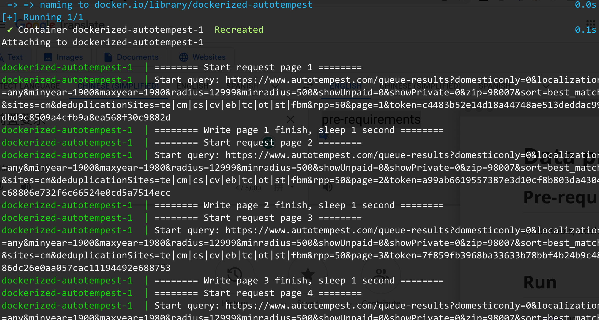

# Data provider

## Pre-requirements

make tools, docker, docker-compose


## Run

```shell
make up
```




The program will query and store 9 pages (1 page 50 records) of information in MongoDB.


## Cleanup

```shell
make down
```

